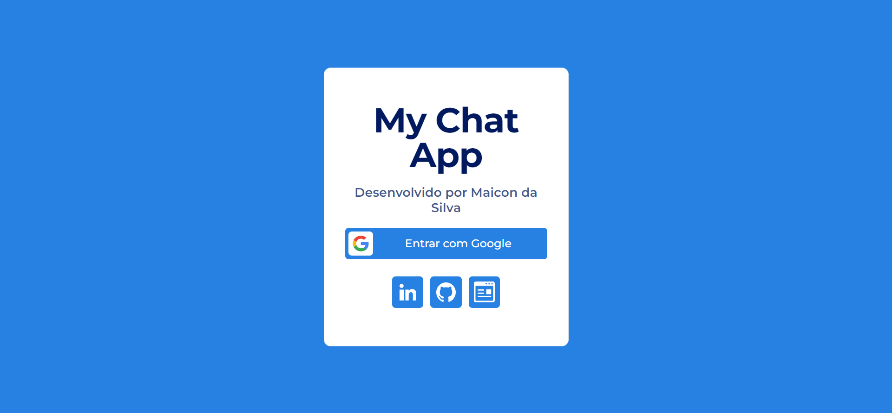

# MyChatApp

## Sobre o projeto

O projeto em questão se trata de um site de chat em tempo real, com a capacidade de conversar em tempo real com qualquer pessoa no mundo inteiro, podendo as encontrar a partir do nome ou email da conta Google, por um mecanismo de pesquisa. Foi desenvolvido de forma autoral com a biblioteca React.Js, também consumindo e enviando dados a partir do Google Firebase, com o objetivo de demonstrar e praticar minhas habiliades como desenvolvedor Front-End e com o React.

É possível acessar a página a partir do botão a seguir.

)

## Layout Mobile

## Layout Desktop

## Tecnologias utilizadas

### Front-End

### Outras

◾️ Google Firebase

## Autor

◾️ Maicon de Oliveira da Silva

